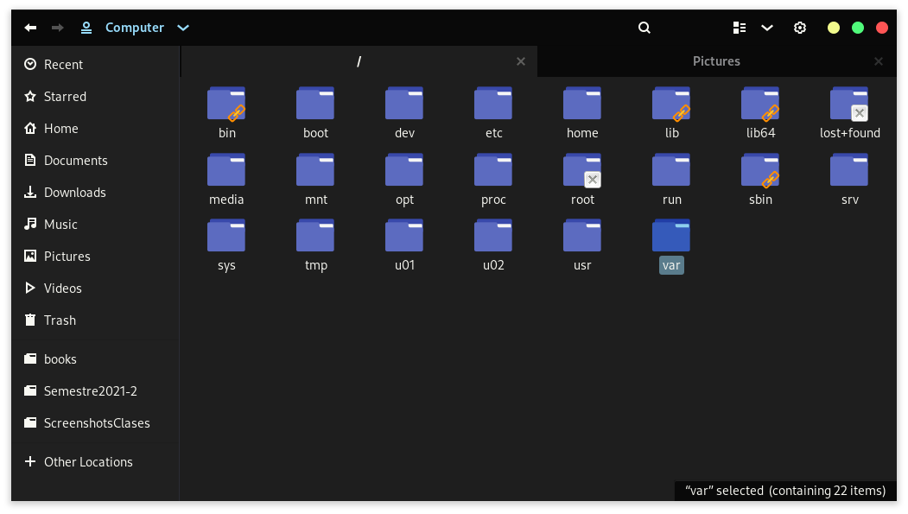
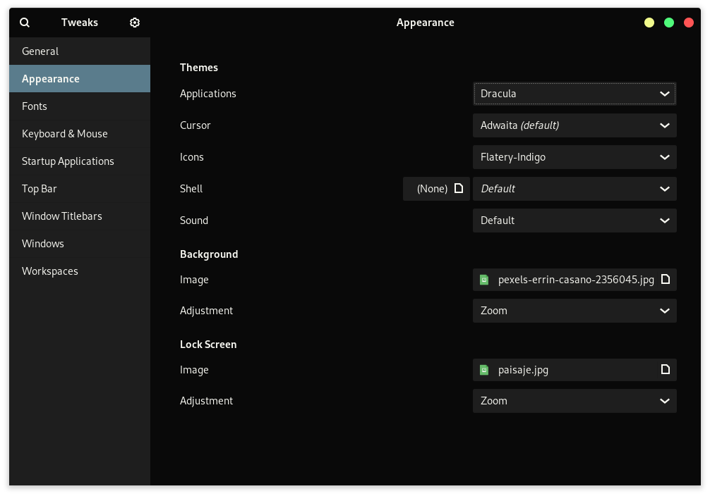

Este es un fork de https://github.com/EliverLara/Ant la cual se puede encontrar en https://www.gnome-look.org/p/1099856/ .
Esta nueva personalizacion manera los colores negro y azul como tema principal.

See also: https://github.com/GuillermoGAndres/Dracula-slim-standard-buttons

# Dracula for [GTK](https://www.gtk.org/)

> A dark theme for [GTK](https://www.gtk.org/).

This theme provides support for GTK-3 and GTK-2 based desktop environments like Gnome, Unity, Budgie, Pantheon, XFCE, Mate, etc. Also provides support for KDE plasma.

## Install

All instructions can be found at [draculatheme.com/gtk](https://draculatheme.com/gtk).

## Team

This theme is maintained by the following person(s) and a bunch of [awesome contributors](https://github.com/dracula/gtk/graphs/contributors).

 | 
--- | 
[Eliver Lara](https://github.com/EliverLara) | 

## License

[GPL-3.0 License](./LICENSE)
